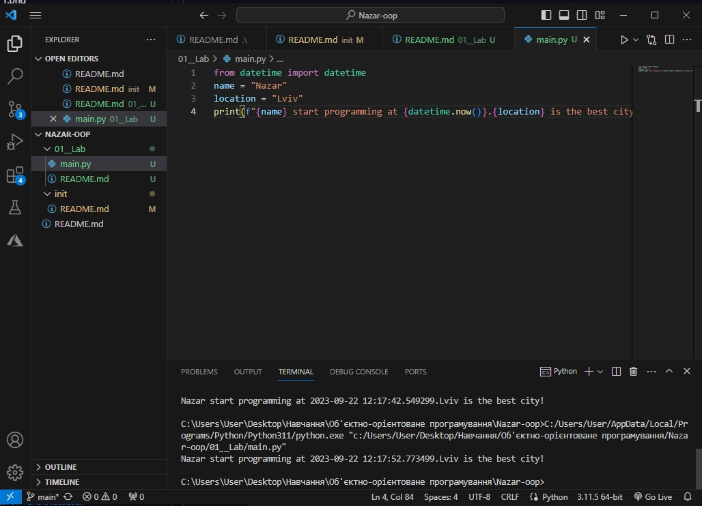
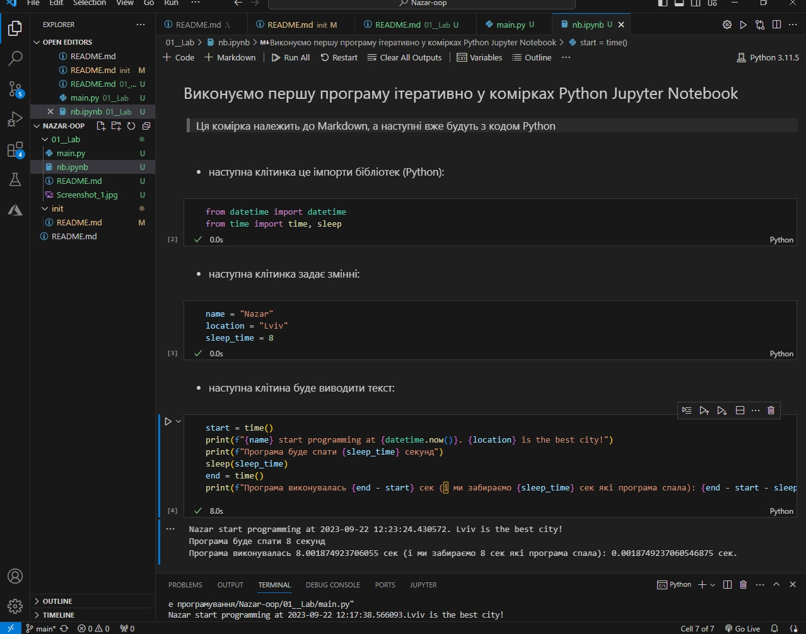
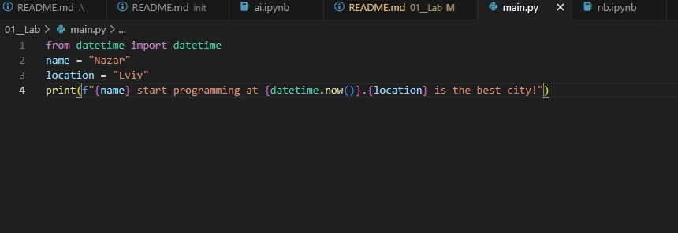

# Звіт до роботи
## Тема: _Оформлення та здача робіт_
### Мета роботи: _навчитись роботі з форматуванням Markdown та створювати звіти з використанням файлів README_
---
### Виконання роботи
### Виконання роботи
- Результати виконання завдання:
    1. Виконали першу програму, результат виконання: ;
    1. Модифікували програму та використали [Python Notebook для її виконання](nb.ipynb);
    1. Після виконання всіх клітинок Python ноутбуку програма вивела: ;
    1. зробили запит до ChatGPT щоб написав та поясним першу програму. Модифікували його відповідь на на її основі зробили [новий Python Notebook](ai.ipynb);
    
    
    1. Програма вивела значення
    1. Отримано наступні результати Nazar start programming at 2023-09-22 12:17:38.566093.Lviv is the best city!
    1. Навчились прості програми на мові Python
- вставлені рисунки (скріншоти екрана або фотографії виконаного завдання у зошиті);
;
> якщо графічних файлів багато то краще помістити їх у окрему папку, наприклад у мене це папка `pictures`. Уважно дивіться коли вставляєте URL - файл має бути представленим як `raw`. 


- вставлений код / текстовий або числовий результат / інші результати:
```python
def simple_function_example():
    pass
```
```text
<< SOME text HERE >>
```

- результати виконання індивідуального завдання (якщо такі є);

### Висновок: 
> у висновку потрібно відповісти на запитання:
- :question: Що зроблено в роботі;
- :question: Чи досягнуто мети роботи;
- :question: Які нові знання отримано;
- :question: Чи вдалось відповісти на всі питання задані в ході роботи;
- :question: Чи вдалося виконати всі завдання;
- :question: Чи виникли складності у виконанні завдання;
- :question: Чи подобається такий формат здачі роботи (Feedback);
- :question: Побажання для покращення (Suggestions);