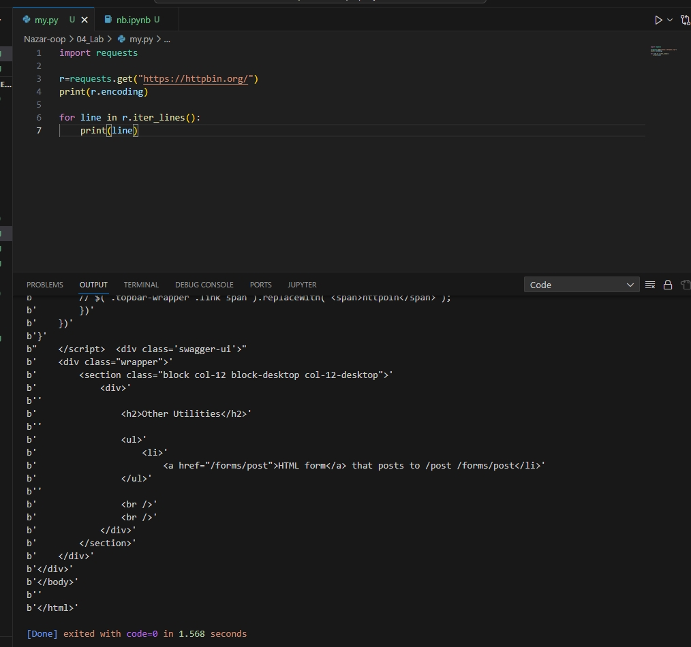
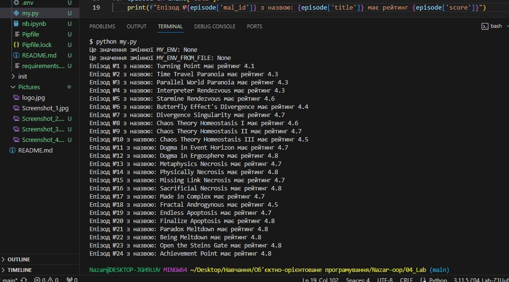

# Звіт до роботи №4
## Тема: _Робота з віртуальними середовищами_;
### Мета роботи: _Навчитись створювати і працювати у віртуальних середовищах Python_;
---
### Виконання роботи
- Результати виконання завдання 1...N;
1. Виконали цілий ряд команд для роботи зі сторонніми бібліотеками у [Python Notebook](nb.ipynb);
2. Проробили команди  для створення віртуального середовища (VENV) та його активації;
3. Остання команда дала такий результат:

Ця команда вказує нам інформацію про біблотеку. Зокрема , її версію, автора, домашню сторінку, ліцензію, залежності та інші деталі, які її стосуються. 

4. Попрацювали з Pipenv. Написаний код видав наступний результат:

5. Попрацювали зі змінними середовищами. Написаний код видав наступний результат:

### Висновок:
>у висновку потрібно відповісти на запитання:

❓ Що зроблено в роботі;

Під час виконання роботи була виконана робота з бібліотеками. Також виконана робота з Pipenv та віртуальними середовищоми.

❓ Чи досягнуто мети роботи;

Так, досягнуто.

❓ Які нові знання отримано;

Отримано знання про сторонні бібліотеки, віртуальні середовища.

❓ Чи вдалось відповісти на всі питання задані в ході роботи;

Так

❓ Чи вдалося виконати всі завдання;

Так.

❓ Чи виникли складності у виконанні завдання;

Були деякі складності з якими вдалось поборотись.

❓ Чи подобається такий формат здачі роботи (Feedback);

Так.

❓ Побажання для покращення (Suggestions);

На даний момент немає побажань.